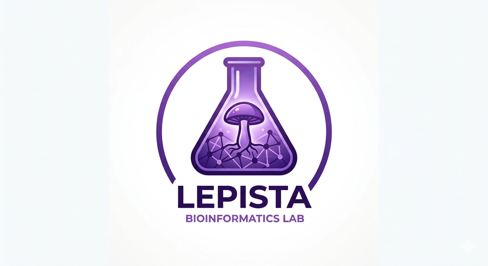

# Lepista Bioinformatics Lab

**Open source bioinformatics and software infrastructure for science and beyond**

---

## About

Lepista Bioinformatics Lab is a virtual open-source laboratory publishing free tools for **bioinformatics** and **general software development**. Our projects range from sequence analysis pipelines and phylogenetic placers to modern API gateways and knowledge graph builders — all designed with quality architecture in mind.

We believe that **good software and good science are inseparable**. That's why every project here follows solid engineering principles: clean architecture, performance-first design, and clear documentation.

---

## Projects

Explore our full portfolio — infrastructure, bioinformatics, knowledge & AI, and cross-cutting projects — on our website:

### 🌐 [**lepista.io**](https://lepista.io)

**[Explore all projects →](https://lepista.io)**

You can also browse every repository directly here on [github.com/LepistaBioinformatics](https://github.com/LepistaBioinformatics).

---

## Tech Stack

---

## Join Us

We're looking for contributors who are passionate about **bioinformatics**, **open science**, or **robust software engineering**.

Whether you're a biologist who codes, a software engineer curious about life sciences, or just someone who wants to build cool things — **you're welcome here**.

Here's how you can get involved:

- **Report issues** — found a bug or have a suggestion? Open an issue in the relevant repository
- **Submit pull requests** — improvements, fixes, and new features are always welcome
- **Improve documentation** — clear docs are as valuable as good code
- **Start a discussion** — have an idea for a new tool or a collaboration? Let's talk

Check our repositories at [github.com/LepistaBioinformatics](https://github.com/LepistaBioinformatics) and look for issues tagged `good first issue` or `help wanted` to get started.

---

## Our Story

Curious about why a mushroom genus became the symbol of a bioinformatics lab? Read the story behind the name:

- [The Story Behind the Name](./history.en-us.md) — English
- [A História Por Trás do Nome](./history.pt-br.md) — Português (Brasil)

---

*Science grows when knowledge is shared freely.*

